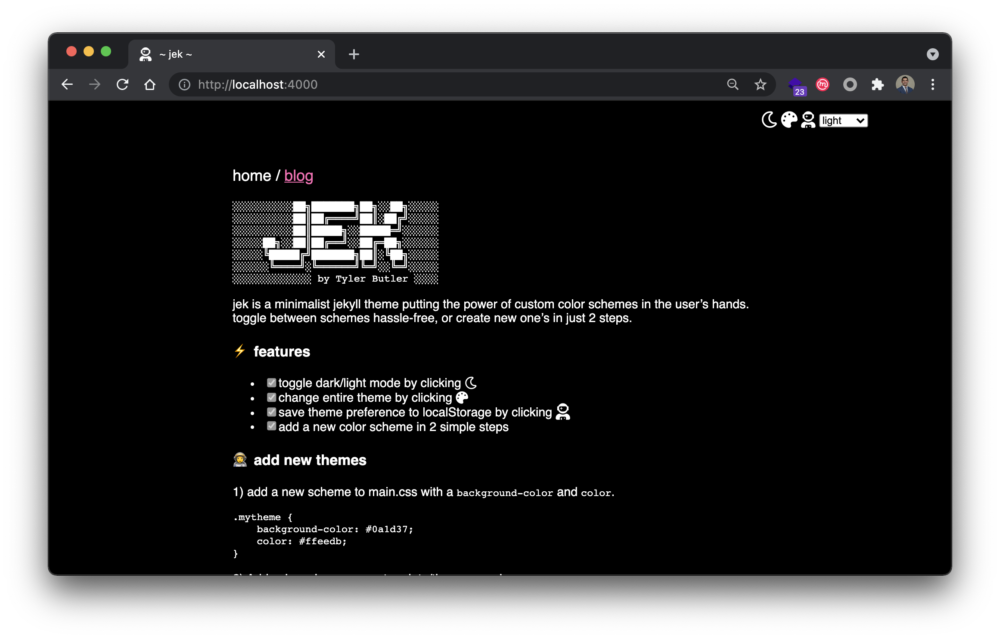
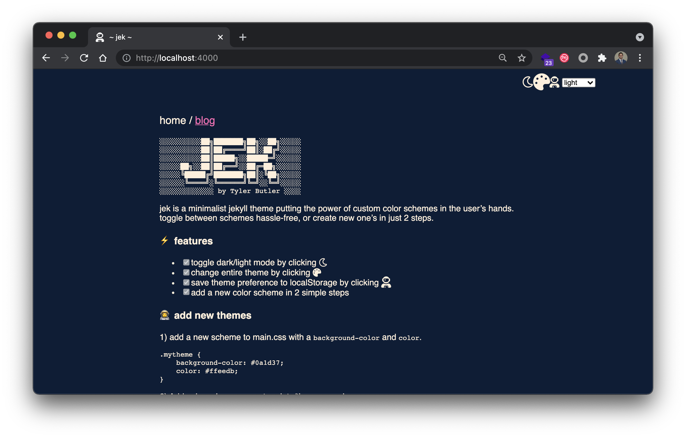
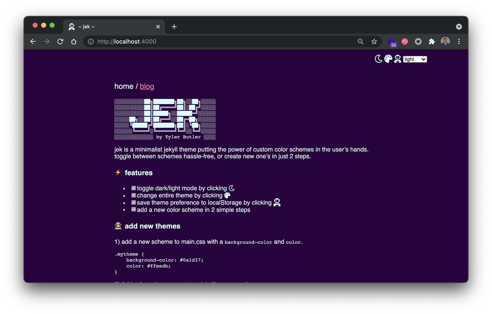

```text
░░░░░░░░░░██╗███████╗██╗░░██╗░░░░░░░░░
░░░░░░░░░░██║██╔════╝██║░██╔╝░░░░░░░░░
░░░░░░░░░░██║█████╗░░█████═╝░░░░░░░░░░
░░░░░██╗░░██║██╔══╝░░██╔═██╗░░░░░░░░░░
░░░░░╚█████╔╝███████╗██║░╚██╗░░░░░░░░░
░░░░░░╚════╝░╚══════╝╚═╝░░╚═╝░░░░░░░░░
░░░░░░░░░░░░░ by Tyler Butler ░░░░░░░░
```  

jek is a minimalist jekyll theme putting the power of custom color schemes in the user's hands. toggle between schemes hassle-free, or create new one's in just 2 steps.

*like the ascii art? make your's at [patorjk](https://patorjk.com/software/taag) or [fsymbols](https://fsymbols.com/text-art/)*
### ⚡ features

+  [x] toggle dark/light mode by clicking <i class="far fa-moon zoom" onclick="changeTheme('dark');"></i>
+  [x] change entire theme by clicking  <i class="fas fa-palette zoom" onclick="changeTheme();"></i>
+  [x] add a new color scheme in 2 simple steps

### 👩‍🚀 add new themes

1) add a new scheme to main.css with a `background-color` and `color`.  

```
.mytheme {
    background-color: #0a1d37;
    color: #ffeedb;
}
```  

2) Add color scheme name to _data/themes.yaml  

```yaml
- name: mytheme
  enabled: true
```

### 🌈 themes

*dark*  



*sunset*   



*dragos*  




